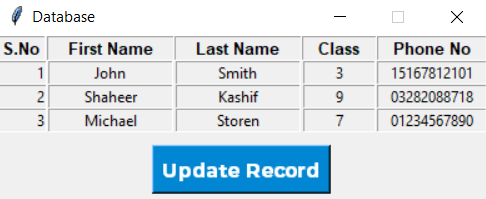

# DatabasePy
A School Database made using SQLite and TKinter.

## Installation For Source Code
1. Clone This Repository to your machine
2. Create a Python virtual environment (optional but recommended) using Command Prompt in the Repository   Folder:
```python -m venv venv```
3. Done!

## Just Want to Play around with the software?
Download databasepy.rar in the build folder, extract it and launch databasepy.exe!

## Some Screenshots of the game:-


